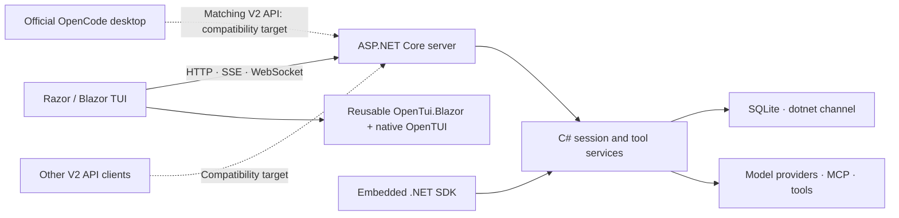

# dotnet-opencode

**A 1:1 port of OpenCode V2 to C# and .NET 11.**

**Command:** `dotnet opencode` · **.NET tool package:** `dotnet-opencode`

- Preserve the upstream behavior, protocol, IDs, and storage contracts.
- Build the implementation with the .NET ecosystem—not a launcher around the upstream server.
- Render the terminal application with **Razor and Blazor over native OpenTUI**.

> **In development:** 1:1 is the compatibility target, not a claim that every feature or client combination is complete. Runtime and visual parity, including official desktop interoperability, are not yet established.

## The .NET stack

- **.NET 11 process APIs** — owned process handles, detached service startup, explicit handle inheritance, and process capture. [Details](docs/dotnet-11.md)
- **Vogen** — 25 strongly typed scalar wrappers, generated validation, and analyzers; existing ID generation and scalar wire formats stay intact. [Migration](docs/vogen-migration.md)
- **System.IO.Pipelines** — buffered SSE, WebSocket messages, daemon frames, and bounded stream ingestion through an application-neutral transport library. [Inventory](docs/pipelines-migration.md)
- **TimeProvider** — host-owned UTC and monotonic clocks, provider-backed application deadlines, delays, and expiry schedules. [Inventory and exceptions](docs/time-provider-migration.md)
- **Channels and `IAsyncEnumerable<T>`** — asynchronous event delivery, streaming responses, and explicit backpressure and cancellation boundaries.
- **Source-generated interop** — `[LibraryImport]`, spans, and explicit native-resource ownership rather than opaque native handles scattered through application code.
- **System.Text.Json source generation** — typed protocol serialization, custom compatibility codecs, and schema metadata.
- **ASP.NET Core** — the C# HTTP server, SSE, WebSockets, authentication, and OpenAPI.
- **System.CommandLine** — one typed command tree for the implemented CLI, including Run, Stats, API, authentication, and standalone hosting. [Command structure](src/OpenCode.Cli/CommandLine/README.md)
- **Razor + Blazor + OpenTUI** — real `.razor` application views, a reusable terminal renderer, native text measurement, selection, images, and embedded terminals.
- **Wasmtime + Tree-sitter** — upstream WASM grammar assets hosted from .NET for syntax highlighting; no substitute regex lexer.
- **Jint + Acornima** — managed JavaScript execution and parsing for Code Mode, with captured tool bindings and explicit compatibility limits.
- **Markdig, AngleSharp, and the official MCP SDK** — .NET libraries for Markdown, HTML processing, and Model Context Protocol integration.
- **SQLite and durable events** — explicit transactions, ordered event history, projections, durable input admission, and restart-recovery markers.

### Ecosystem migrations in progress

- **EF Core 11 + SQLite** — full persistence migration to fluent mappings and LINQ, preserving the existing schema, source migration runner, transaction boundaries, and explicit SQLite-specific operations.
- **Meziantou.Analyzer** — compile-time quality checks and a full diagnostic cleanup, coordinated with the persistence migration.
- Marten, Fisher, and Wolverine are **not part of the selected persistence stack**.

## Same protocol. C# server.



- **The goal: keep the official desktop and swap its backend for the C# server.** This requires a desktop build that speaks the matching upstream V2 API; it is not a verified drop-in promise for every released desktop version.
- The native .NET TUI uses the same HTTP/SSE server boundary. The embedded SDK shares the underlying services without creating an HTTP listener or managed daemon.
- The application implementation is C# and Razor. Bun, Node, and SolidJS are not needed to launch the .NET CLI/TUI/server; configured external tools can have their own dependencies.

## Built around real workflows

- Durable prompt admission, queue/steer controls, permissions, forms, model execution, and tool-result continuation.
- Background jobs, subagents, compaction, fork, movement, revert, and restart recovery.
- Session tabs, model preferences, command palette, settings, prompt stash, structured attachments, and recovery views.
- MCP management, provider authentication, credential selection, VCS/worktrees, archives, statistics, and a typed .NET client/SDK.
- Native image and terminal presentation—not a browser-hosted TUI or a plaintext imitation of a terminal emulator.

## Install as a .NET tool

- The tool command is `dotnet-opencode`; the .NET CLI also exposes it as **`dotnet opencode`**.
- Development prereleases are published to [NuGet.org](https://www.nuget.org/packages/dotnet-opencode). See [packaging notes](packaging/README.md) for payload and platform limits.
- Install the exact **.NET 11 Preview 7 SDK** `11.0.100-preview.7.26381.103` first. The tool requires its matching .NET and ASP.NET Core shared frameworks; runtime roll-forward is disabled. The bundled OpenTUI binary supports **Windows x64**.
- Default-branch releases use UTC-timestamped prerelease versions and GitHub OIDC **NuGet Trusted Publishing**, without a stored long-lived API key. [Publishing setup](packaging/TRUSTED-PUBLISHING.md)
- With that SDK on `PATH`:

```powershell
dotnet tool install --global dotnet-opencode --prerelease
dotnet opencode
dotnet opencode run "Explain the structure of this repository."
```

## Run from source

- Install PowerShell 7+ and the **exact .NET 11 Preview 7 SDK pinned in [global.json](global.json)** into the repo-local `.dotnet` directory, or configure `OPENCODE_DOTNET_SDK_ROOT`.
- Use `run.ps1` from the project directory you want OpenCode to work in. It preserves that directory and builds into isolated artifacts.

```powershell
# Native Razor / Blazor terminal client
./run.ps1

# Headless request through the server
./run.ps1 -- run "Explain the structure of this repository."

# Private server lifetime; no managed-service registration
./run.ps1 -- tui --standalone

# C# server on the dotnet channel's default port
./run.ps1 -- serve --port 5055
```

- Full setup, SDK installation, and deployment details: [RUNNING.md](RUNNING.md).
- Managed services run from immutable, content-addressed deployments, avoiding mutable-build DLL locks and mixed CLI/server builds.

## Separate channel, shared conventions

- Default server port: **5055**.
- Database: **`opencode-dotnet.db`**.
- Managed registration: **`service-dotnet.json`**.
- Client-local state is isolated in the **`dotnet`** channel; upstream user configuration conventions are retained.
- No automatic copying of the production OpenCode database or credentials.

## Compatibility boundaries

- External JS/TS plugin compatibility and remaining provider/language edge cases are still under development.
- Some historical migrations intentionally remain blocked rather than discard data or import credentials without an explicit policy.
- Persistent terminals require the compatible native `opencode-pty` backend. Upstream currently supplies no packaged Windows daemon artifact. [Deployment details](build/PTY-ASSETS.md)
- Build success is not proof of end-to-end desktop, provider, native-rendering, or database compatibility.

## Explore the implementation

- [Full TUI parity scope](docs/tui-parity-scope.md)
- [Owned SDK host](src/OpenCode.Sdk/OWNED-HOST.md)
- [Native interop and rendering](src/OpenTui.Native/)
- [Reusable Blazor terminal components](src/OpenTui.Blazor/)
- [Protocol and wire contracts](src/OpenCode.Protocol/)
- [Server implementation](src/OpenCode.Server/)

Independent port of [OpenCode V2](https://github.com/sst/opencode/tree/v2), not an official OpenCode release. Upstream attribution and third-party provenance are retained with the corresponding source and assets.
